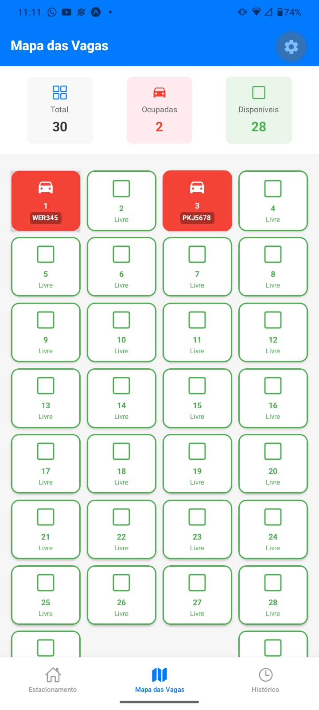

<div align="center">


  
    
 
 
 
 </div>
 
# 🅿️ Parking App - Sistema de Gestão de Estacionamento


## 📱 Sobre o Projeto

Aplicativo completo para gestão de estacionamento, desenvolvido com React Native para o frontend e Node.js para o backend. O sistema permite registrar entrada e saída de veículos, calcular valores automaticamente (R$5/hora ou R$50 diária), visualizar mapa de vagas e gerar comprovantes em PDF.

### ✨ Funcionalidades

- ✅ **Registro de Entrada**: Cadastro com foto, vaga, placa, cliente, marca e cor do veículo
- ✅ **Timer em Tempo Real**: Atualização contínua do tempo estacionado
- ✅ **Cálculo Automático**: Valor calculado dinamicamente (R$/hora ou diária)
- ✅ **Mapa de Vagas**: Visualização de 30 vagas com status ocupado/livre e placa do veículo
- ✅ **Saída e Comprovante**: Geração de PDF com todos os dados para impressão/compartilhamento
- ✅ **Histórico Completo**: Registro de todas as movimentações com busca de comprovantes
- ✅ **Persistência de Dados**: Armazenamento em JSON, mantendo dados entre reinicializações

## 🛠️ Tecnologias Utilizadas

### Frontend
- **React Native** + **TypeScript** - Estrutura principal do app
- **Expo** - Framework para desenvolvimento mobile
- **React Navigation** - Navegação por abas
- **Expo Vector Icons** - Ícones da aplicação
- **Expo Image Picker** - Captura de fotos (câmera/galeria)
- **Expo Print** - Geração de comprovantes PDF

### Backend
- **Node.js** + **Express** - API REST
- **JWT** - Autenticação de usuários
- **File System (fs)** - Persistência em arquivo JSON
- **CORS** - Comunicação cross-origin

## 🚀 Como Executar o Projeto

### Pré-requisitos

- Node.js (versão 18 ou superior)
- npm ou yarn
- Expo CLI
- Emulador Android/iOS ou dispositivo físico com Expo Go

### Backend

```bash
# Acessar pasta do backend
cd backend

# Instalar dependências
npm install

# Iniciar servidor
npm run dev
